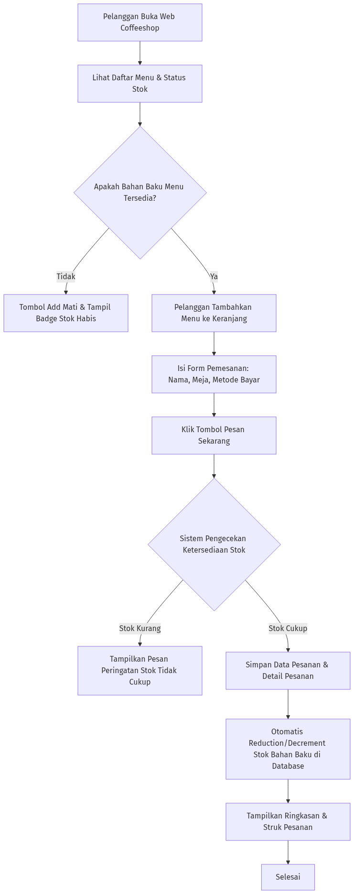
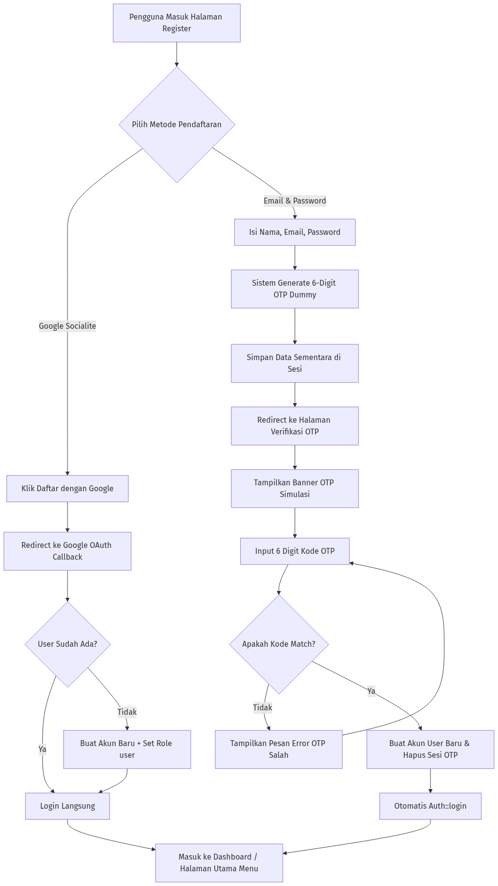
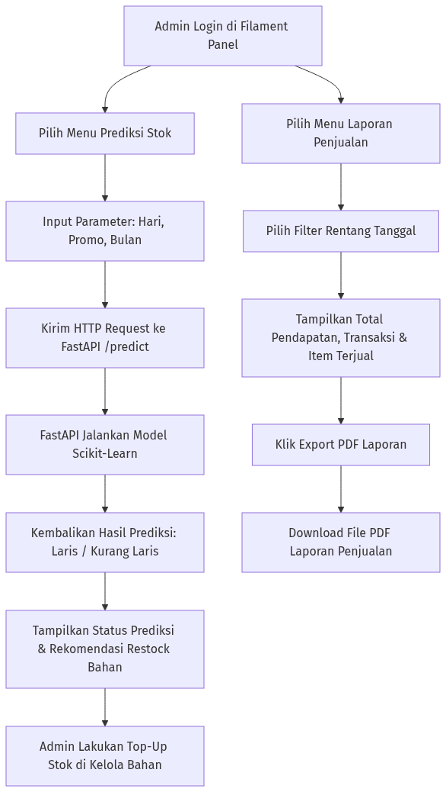

# ☕ Sistem Informasi Pemesanan & Manajemen Stok Coffeeshop (SIPAKAR)

[](https://laravel.com)
[](https://filamentphp.com)
[](https://fastapi.tiangolo.com)
[](https://python.org)
[](https://tailwindcss.com)

**SIPAKAR Coffeeshop** adalah aplikasi manajemen bisnis coffee shop modern berbasis web. Aplikasi ini mengintegrasikan platform pemesanan mandiri untuk pelanggan (*Self-Ordering System*), panel administrasi berbasis **Filament v3**, pemotongan stok bahan baku otomatis berbasis resep, serta **Machine Learning Microservice** untuk prediksi ketersediaan dan rekomendasi pemulihan stok.

---

## 👥 Tim Kontributor & Pengembang

| Nama Lengkap | NIM |
| :--- | :--- |
| **Arizal Firdaus Bagus Pratama** | `2413010683` |
| **Muhammad Hanif Hidayah Saputra** | `2413010698` |
| **Hanif Difa Syarifudin** | `2413010681` |
| **Ridwan Rafli Hidayat** | `2413010672` |

---

## 🛠️ Dokumentasi Development

Dokumentasi Development ini memuat panduan arsitektur teknis, prasyarat lingkungan, serta langkah-langkah dalam menyiapkan (*setup*) dan menjalankan lingkungan pengembangan (*local development environment*).

### 📐 Arsitektur Sistem
Aplikasi ini dibangun menggunakan pendekatan **Hybrid Microservice**:
1. **Laravel 10/11 (Main Core)**: Menangani routing pelanggan, otentikasi (Socialite & OTP), manajemen pesanan, dan Filament Admin Panel.
2. **FastAPI ML Microservice (`/ml-api`)**: Service Python terpisah yang mengeksekusi model Machine Learning (`model_dt.pkl`) untuk memprediksi kategori menu *Laris* vs *Kurang Laris* dan memberikan rekomendasi stok.
3. **Database Layer**: Menggunakan MySQL / PostgreSQL (Supabase) dengan dukungan migrasi & seeder penuh.

---

### 💻 Prasyarat Sistem (Prerequisites)
Sebelum menjalankan proyek, pastikan perangkat Anda telah terpasang software berikut:
- **PHP** `>= 8.2` (dengan ekstensi `pdo`, `mbstring`, `openssl`, `curl`, `gd`)
- **Composer** `>= 2.x`
- **Node.js** `>= 18.x` & **NPM**
- **Python** `>= 3.10` & `pip`
- **Database**: MySQL `>= 8.0` atau PostgreSQL (Supabase)

---

### 🚀 Langkah-Langkah Setup (Development Installation)

#### 1. Clone Repository & Install Dependensi PHP/JS
```bash
git clone https://github.com/kampusriset/24f_laravel_sipakar_coffeshop.git
cd 24f_laravel_sipakar_coffeshop

# Install dependensi Laravel
composer install

# Install dependensi Frontend
npm install
```

#### 2. Konfigurasi Environment (`.env`)
Salin file environment dan generate Application Key:
```bash
cp .env.example .env
php artisan key:generate
```

Pastikan pengaturan database di `.env` sudah sesuai:
```dotenv
DB_CONNECTION=mysql
DB_HOST=127.0.0.1
DB_PORT=3306
DB_DATABASE=coffeeshop
DB_USERNAME=root
DB_PASSWORD=
```

#### 3. Migrasi & Seeder Database
Jalankan migrasi database beserta data awal (*default admin, kasir, menu, kategori, dan bahan baku*):
```bash
php artisan migrate:fresh --seed
php artisan storage:link
```

#### 4. Setup Microservice Machine Learning (Python FastAPI)
Masuk ke direktori `ml-api` dan siapkan virtual environment:
```bash
cd ml-api
python3 -m venv venv
source venv/bin/activate # Di Windows: venv\Scripts\activate
pip install -r requirements.txt
cd ..
```

---

### ⚡ Menjalankan Aplikasi

Anda dapat menjalankan seluruh komponen aplikasi (Laravel Web, Filament Admin, Vite Assets, dan FastAPI ML Service) secara **otomatis** dengan 1 perintah:

- **Linux / macOS**:
  ```bash
  ./start-dev.sh
  ```
- **Windows**:
  ```cmd
  start-dev.bat
  ```

Aplikasi akan aktif di alamat:
- 🌐 **Web Pelanggan**: `http://localhost:8000`
- ⚙️ **Admin Panel (Filament)**: `http://localhost:8000/admin`
- 🤖 **Machine Learning API**: `http://localhost:8001/docs`

#### 🔐 Kredensial Pengguna Bawaan (Default Credentials):
- **Super Admin**: `admin@coffeeshop.com` | Password: `admin123`
- **Kasir**: `kasir@coffeeshop.com` | Password: `kasir123`
- **Pelanggan Demo**: `user@coffeeshop.com` | Password: `user123`

---

## 📊 Alur & Flowchart Sistem

Berikut adalah diagram alur proses utama yang berjalan dalam aplikasi **SIPAKAR Coffeeshop**:

### 1. Alur Pemesanan Pelanggan & Pengurangan Stok Otomatis
Flowchart ini menjelaskan bagaimana pelanggan memilih menu, sistem mengecek stok bahan baku, hingga stok terpotong secara otomatis saat transaksi dibuat:



---

### 2. Alur Registrasi Akun Pelanggan (Email + OTP Dummy & Google Socialite)
Flowchart ini menggambarkan proses registrasi akun baru untuk pelanggan guna mendapatkan diskon promo acak:



---

### 3. Alur Dashboard Laporan Penjualan & Prediksi Stok Machine Learning
Flowchart ini menjelaskan bagaimana admin mengelola bisnis dan memprediksi kebutuhan stok bahan baku:



---

## 📝 Lisensi
Proyek ini dibuat untuk keperluan tugas akademik dan pengembangan sistem informasi bisnis Coffee Shop. Lisensi resmi MIT tersedia pada berkas [LICENSE](LICENSE).
